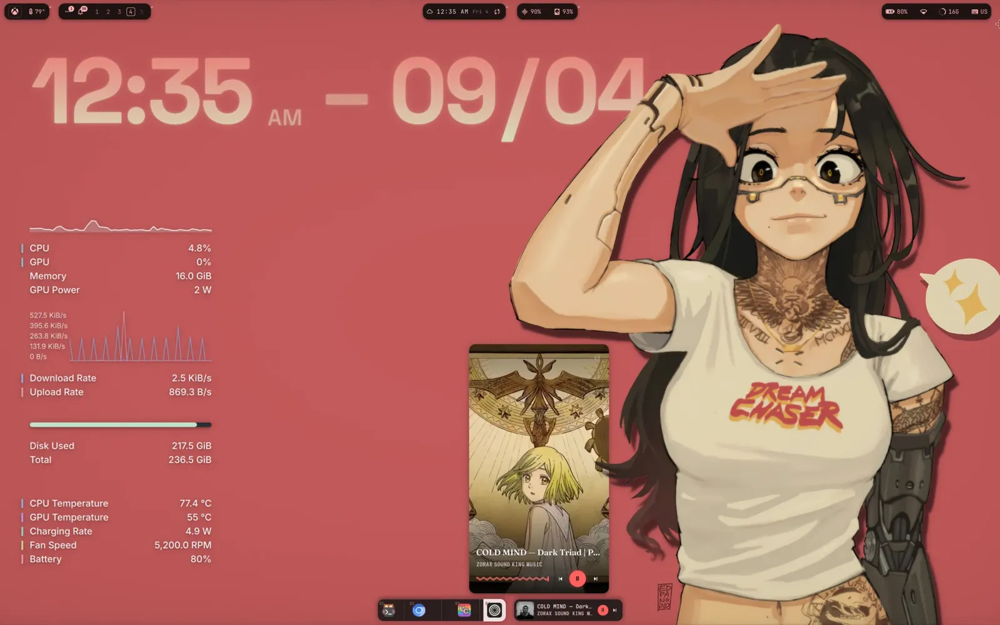

# UI and UX

The desktop is **paper and ink**: a monochrome printed instrument. Warm bone ink
on pure-black paper, hairline rules instead of shadows, and inversion (a surface
flipping to a bone plate) as the only emphasis. There is no colour in
app chrome; the accent is reserved for the frame, the 力 seal, and art, which
manufactures its own red sun. Fraunces sets the display, Space Grotesk carries
the language, SpaceMono carries the data, Noto Sans CJK JP carries the seals.

*The desktop: the bar at the top edge, the dock at the bottom, a clock widget on
the wallpaper, and nothing else asking for attention.*

The one place the look is defined is `ryoku/ui/Singletons/Tokens.qml`: every
surface reads its colour, type, geometry, and motion from there, and nothing
hardcodes a value. This doc is how that language is applied across the QML
desktop: the tokens, the type, the geometry, the shared primitives, the pages,
the surfaces, and the motion. The UI is Quickshell (QML) in
`ryoku/shell/quickshell/` (plus Ryoku Settings in `ryoku/hub/quickshell/` and the
apps in `ryoku/apps/`), driven by the `ryoku-shell` daemon.

## Design language

Bone on black, one contrast-solved ink ramp, no colour in the content. Restraint
is the point: flat surfaces, hairline depth, generous spacing. A surface earns
its place; if it does not, remove it.

- **Pure-black paper, warm bone ink.** The paper is a flat `#000000`: nothing is
  laid over it, because a texture behind a settings sheet is decoration a reader
  has to see past. The ink is a warm bone in four contrast-solved tiers, never pure white:
  `#cdc4ba` (12:1, values and titles), `#b0a9a0` (9:1, nav and body), `#958f87`
  (6.6:1, descriptions), `#7a756e` (4.6:1, tags and struck defaults). Nothing
  sits below 4.5:1, so any text is legible at any tier. Those four are the
  *signature defaults*; a theme may replace them, and the ramp's shape is what
  the design guarantees, not the exact hex.
- **Emphasis is inversion, not colour.** App content (the Hub, ryowalls, ryovm,
  ryostore) carries no accent at all. To stress a surface it flips to a bone
  plate with dark ink: the selected nav item, the connected network, the active
  tab. There is no second value. Even a destructive confirm is a bone plate and
  an unambiguous word, not a red one. The bone stock is the Material
  inverse-surface pair (`Tokens.bone` / `Tokens.inkOnBone`), so the plate and its
  ink keep their contrast on a light theme as well as a dark one.
- **The accent lives on the frame, not the content.** The shell frame carries the
  accent, and `Scheme.primary` is where it comes from. The content never competes
  with it.
- **Colour is data, and the red sun is brand.** The only colour inside a surface
  is data doing its job: a palette swatch being its own colour, a signal bar, or
  art manufacturing its own sun. Two tokens stay fixed on any wallpaper:
  `Theme.brand` (`#e2342a`, the vermillion the 力 seal is drawn in, which never
  themes, and that is the point) and `Tokens.alert` (the same red, so a badge
  always reads as an alert). Everything else is derived. Use the seal as a mark
  (the masthead, an eyebrow lead), not as decoration.
- **Depth is a hairline, not a shadow.** Surfaces are flat with a `1px` bone
  hairline; a shadow appears only where something genuinely floats over
  something else (a popout, a drawer, a dock island). The Hub and apps are print
  and do not cast.
- **The print texture rides the chrome, never the content.** The poster
  ornaments are real, but they belong on the always-present furniture, not
  behind the thing being read: `Reg` sits behind a nav rail (QS Bar Settings'),
  and `Marginalia` + `Barcode` dress a surface that has a dead margin for them.
  A settings plate gets flat paper. `Grain` is for art surfaces only. A texture
  under a control is decoration the reader has to see past, so it is a bug.
- **Latin names the thing, kanji seals it.** Every nav item, section eyebrow and
  poster plate pairs a Latin word with its real Japanese gloss: 画面 Displays,
  接続 Connections, 入力 Input, 矢印 Cursor, 演算 Machine, 外観 Appearance,
  卓上 Desktop, 部品 Widgets, 動き Animations, 施錠 Lockscreen, 起動 App
  Launcher. Two scripts sitting together is the texture. Every gloss is the real
  word, never decoration.

## Tokens: never hardcode a value

Every surface reads its look from `Ryoku.Ui`. One module, imported by the shell's
configs, the Hub and the apps. `import Ryoku.Ui.Singletons` and read `Tokens`;
never write a hex, a font name, a radius or a duration in a component.

    import Ryoku.Ui
    import Ryoku.Ui.Singletons

### Colour resolves through a chain, it is not a constant

`Tokens` does not hold colours. It holds a *resolution*: every colour token is
`role(materialRole, signatureDefault)`, and `role()` walks three layers in order.

1. A fixed named scheme (`shell.json` `themePalette`) wins, if one is set.
2. Otherwise the live wallpaper palette (`~/.cache/ryoku/colors.json`, Material
   roles written by the daemon), while *Match wallpaper* is on.
3. Otherwise the compiled signature default.

So every Ryoku app retints on any scheme change, a named theme or a wallpaper
switch, with no colour maths of its own. A half-written role (a `colors.json`
caught mid-write, a scheme missing a key) falls through to the next layer rather
than painting black. The three files are read as raw text and watched, because
the `on*` Material role names defeat `JsonAdapter`'s signal-handler grammar and a
removed `themePalette` key only reads as absent from raw text.

|Token|Material role|Signature default|What it is|
|---|---|---|---|
|`paper`|`surface`|`#000000`|the sheet|
|`paperLift`|`surfaceContainerLow`|`#0a0a0a`|a surface lifted off the sheet|
|`ink`|`onSurface`|`#cdc4ba`|values and titles, 12:1|
|`inkDim`|`onSurfaceVariant`|`#b0a9a0`|nav and body, 9:1|
|`inkMuted`|`outline`|`#958f87`|descriptions, 6.6:1|
|`inkFaint`|`outlineVariant`|`#7a756e`|tags and struck defaults, 4.6:1|
|`bone`|`inverseSurface`|`#cdc4ba`|the inverted plate|
|`inkOnBone`|`inverseOnSurface`|`#000000`|ink on that plate|
|`sun`|`primary`|`#e2342a`|the accent|
|`alert`|fixed|`#e2342a`|never derived: an alert is an alert|

Hairlines and tints are ink-derived, so they follow whatever the ink resolved to:
`line` (26% ink), `lineSoft` (13%), `lineStrong` (42%), and the interaction tints
`tint5` (surface hover), `tint10` (control hover), `tint16` (pressed). The
recording keycaps are the one fixed stock (`keycapDark` `#17171a`, `keycapLight`
`#f4f2ed` and their inks), because a keycap in a screen recording is media, not
chrome, and must not shift with the wallpaper.

### The shell resolves the same palette through `Scheme`

The Hub and the apps read `Tokens`. The shell surfaces read
`shell/services/Scheme.qml`, which resolves the same daemon Material roles for
the shell process, and each surface keeps a thin local `Theme.qml` that names the
roles *that surface* uses. Those adapters are 14 to 133 lines and hold no
palette of their own:

|Adapter|Reads|
|---|---|
|`shell/services/Theme.qml`, `desktop/`, `overview/`, `plugins/kit/`|`Scheme`|
|`launcher/shared/`|`Scheme` and `Tokens`|
|`ryoshot/`, `ryopin/`, `welcome/`|`Tokens`|
|`wallpaper/`, `wallpaper/switcher/`|the default paper only, for letterbox margins|

Two files are genuinely their own thing and should stay that way:
`barstyles/qsbar/Theme.qml` (a bar style's entire configuration surface, which
owns its own look by contract, see `docs/barstyles.md`) and
`hub/quickshell/Singletons/Theme.qml`, a leftover of the old website palette that
survives in exactly one preview file and should go the next time that preview is
touched.

The rule this replaced is worth remembering. There used to be eleven
`Singletons/Theme.qml` copies kept in step by hand. They were not in step. They
had drifted into three families with the same token names carrying different
values: `Theme.border` was a width in the Hub and a colour in the pill, so a file
moved between them broke silently, and `border2` exists because the width token
was evicted to make room. A local `Theme.qml` today is allowed to *name* roles; it
is not allowed to *define* values. If a value is missing from Tokens, add it to
Tokens.

### Where the module lives

The module lives at `ryoku/ui/`. An installed system reads it from
`/usr/lib/qt6/qml/Ryoku/Ui`, which Qt resolves unaided. A deploy.sh checkout puts
it under `~/.local/lib/qt6/qml`, and only the daemon injects that path
(`ipc/daemon.go`), so `qs -c hub` from a keybind cannot see it without
`QML_IMPORT_PATH`. `hyprland/modules/env.lua` sets it for the session. If an
import fails in dev and works on an installed box, that is why.

### The one sanctioned brand takeover

**Rashin** (`hub/pages/RashinPage.qml`) fronts the Rashin/Hermes dashboard
(`127.0.0.1:3600`), so it deliberately wears that product's identity instead of
the Hub's: the warm poster palette and Archivo Black type mirrored from
`ryoku/rashin/backend/web/css/base.css`, kept in one local palette object at the
top of the page plus a bundled `fonts/archivo-black.ttf`. It is a page-scoped
brand takeover, not drift; keep it in step with that `base.css`, and do not copy
the pattern into another page.

### What follows the wallpaper, and what does not

The old text here described a `Palette.accent` clamp and a `shade()` tone-map in
QML. Neither exists any more, and what replaced them is simpler to reason about:
the daemon runs matugen over the wallpaper and publishes a full Material role set
to `~/.cache/ryoku/colors.json`, along with the wallpaper's own luminance. Material's
tone system already answers "what reads on this panel", so the shell stopped
doing that arithmetic itself.

- **The whole role set follows the wallpaper, not just the accent.** Paper, ink,
  bone and accent all resolve through the chain above, so the near-black canvas
  is derived. A named theme in `shell.json` pins it instead.
- **`Ink` answers the question a role cannot.** A Material role knows what reads
  on a *panel*; it knows nothing about a surface floating on the wallpaper (the
  desktop clock, the spectrum, a widget with its backing set to none). Handed
  `onSurface`, those paint the tone Material chose for a panel that is not there,
  which on a light scheme is near-black. So `Ink.legible(bg, role, minRatio)`
  corrects a role against a colour you actually have, and `Ink.inkOver()` /
  `Ink.accentOver()` pick a tone off matugen's own ramps against the published
  wallpaper luminance. Both work in CIE L*, where a tone distance is a contrast
  budget: 40 apart clears 3:1, 50 apart clears 4.5:1. Text gets the full 0..100
  range, because near-black and near-white are exactly what text wants; an accent
  is held between 30 and 88, because outside that every hue reads as black or
  white and a mid-tone wallpaper would otherwise turn the spectrum into bars of
  soot.
- **The 力 seal is never derived.** `Theme.brand` is a fixed vermillion, and
  `Tokens.alert` is the same red. A sun is a sun on any wallpaper.
- **App content carries no accent at all.** The Hub, ryowalls, ryovm and ryostore
  are paper and ink. Emphasis is inversion: a surface flips to bone and its ink
  flips to dark. The frame carries the accent; the content does not compete with
  it.
- **The default bar is the one surface that wears the whole palette.** QS Bar,
  the shipped default, retints every slot from the wallpaper's seven colour slots
  (`color01..color07`, mapped onto the ANSI roles), not just the accent, so it
  reads in full colour like a terminal theme. It is a deliberate exception opted
  into as the default; the Hub, the apps, the frame, and the monochrome Sumi bar
  hold the line above. See `docs/barstyles.md`.

So the rice wins inside an envelope the brand enforces. Write that down rather
than the reverse: the envelope is the design.

## Type

Self-hosted, no CDN. Four families, one role each:

|Role|Family|Token|
|---|---|---|
|Editorial headlines|**Fraunces**|`Tokens.display`|
|UI, body, labels, numerals|**Space Grotesk**|`Tokens.ui` (a user's configured UI font overrides it)|
|Tabular data only|**SpaceMono Nerd Font**|`Tokens.mono`|
|Kanji seals (力, 接続, 断)|**Noto Sans CJK JP**|`Tokens.jp`|

One size ramp, eight steps, and a step is a role rather than a number to pick:
`fTitle` 32 (the page title, Fraunces), `fHero` 34 (a headline readout), `fValue`
26 (a cell's value), `fRow` 15 (a row name), `fBody` 14, `fSmall` 13
(descriptions), `fMicro` 11 (tracked labels), `fTiny` 9 (corner tags, struck
defaults).

Mono labels are uppercase with wide tracking (`Tokens.trackLabel` 1.4,
`Tokens.trackMark` 2.2); that spacing is the technical, poster feel. Keep it.

Mono is not the UI face. It carries what is literally valid in a config file:
keys, ranges, defaults, paths, ids. Everything a human reads as language is
Space Grotesk, numerals included. Setting the whole UI in mono makes it read as
a terminal instead of a printed instrument, which is a different product.

## Geometry

- **A hair of rounding.** `Tokens.radius` is `6`. Cards, rows, inputs, chips and
  menus take it. Only true circles stay round: status dots, toggle knobs,
  badges, the VRAM ring. The outer Hyprland window rounding is the user's own
  knob; inside our surfaces we stay close to square.
- **Hairline borders.** `1px` (`Tokens.border`) at `Tokens.line`. Depth is a
  hairline, not a glow.
- **One spacing scale.** `s1` 4, `s2` 8, `s3` 12, `s4` 16, `s5` 24, `s6` 32,
  `s7` 48. Nothing between them.
- **Fixed furniture.** A settings row is `rowH` 48 tall, a cell `cellH` 104, a
  control `ctlH` 26, a nav rail `railW` 268. A page never invents these. A framed
  page fills the window beside the rail, and the sheet puts its groups in as many
  card columns as the measure holds (three on a page-wide window), each card
  capped at `cardMax`.

## A page uses the window it was given

The Hub opens page-wide, and a page that refuses the width it was given is the
bug this section exists to prevent.

- **The body takes the width it is given.** A page's scroll or body region never
  caps itself (no `Math.min(parent.width, Tokens.contentMax)` on the body). The
  grid caps itself through its cards instead. Only *prose* keeps a reading cap: a
  paragraph, a help line, a release note, a blurb.
- **The head sits on the body's grid.** An eyebrow, title and blurb start at the
  body's left inset and span its width, so a page's title aligns with its first
  card column rather than floating in the middle of the window.
- **Content anchors to the top, always.** No block is centred by height, and no
  page spreads spare room into its rows: a block whose place depends on its height
  visibly hops as cards measure in ("flickers when I switch to it"), and the same
  first card then sits at two different heights on two pages. One place, always
  the top, is what lets a reader build a map of the page. A sparse page is honest
  empty paper below the cards; the answer to thinness is a merge, not padding.
- **A page that fits does not scroll, and a page that overflows does.** Every
  scroller carries a `ScrollRail` and declares `WheelScroll { }` inside it, because
  a plain `Flickable` does not answer the wheel on this stack (see Motion below).
  A scroller with nothing to scroll clamps and stays put.

## Motion and input

- **Every scroller answers the wheel.** `WheelScroll` (declared inside the
  `Flickable`/`ListView`, beside its `ScrollRail`) scrolls it one notch per 120
  units of `angleDelta`, clamped to its bounds. A handler only receives events over
  its own parent, so it cannot live in the rail: a handler inside a `Flickable` is
  reparented to that flickable's `contentItem`, which is why the component walks up
  to the item that owns `contentHeight`. A control that wants the wheel for itself
  keeps it, since an inner handler accepts the event first.
- **A page swap does not reflow.** The two loaders crossfade the incoming page, and
  the page's own first layout is synchronous, so nothing moves after the fade
  starts. Length-dependent placement and post-load measurement timers are what make
  a page jump; there are none.

## Disclosure, not walls

- **A page leads with what a user came for.** A rarely-touched cluster folds
  (`SettingCard.expanded: false`) and its header says what it hides
  (`SettingCard.summary`: "4 SWITCHES"), because a folded card with no trace of
  its contents reads as an empty one.
- **A deep knob is `adv: true`**, hidden behind the rail's Advanced switch and
  still reachable from search. Nothing is ever buried beyond a search.
- **A toggle is only for a true binary.** A choice among modes is a `Seg`, a
  family of related on/offs is a `Multi`, a number is a `Step` or a `Slid`, and
  `Spans.controlFor` already decides this from the value's kind. Reaching for a
  switch because the key is a `bool` is how a page becomes a wall of switches.
- **A control that cannot work is never offered.** An affordance beside an empty
  list is armed only when the list has something to act on (`Btn.armed`), and a
  row the active compositor cannot back is dropped, not shown dead.
- **Copy is measured, not guessed.** A row's description is one line and 60
  characters at a three-column card; a page blurb is 70. A description that only
  restates its label is deleted. These caps are enforced by reading the live
  page, not by counting characters in a file.
- **No shadows in app surfaces.** The Hub and the apps are print: a flat
  instrument sheet does not cast. The brutalist offset shadow is retired; an
  overlay separates with `Tokens.paperLift` and a `lineStrong` border instead.
  The frame's own drop shadow over the wallpaper is a different thing and is
  outside this doc.

## The idioms: shared primitives

They live in `Ryoku.Ui`, and `ryoku/ui/qmldir` exports 41 components plus three
maths libs. Reuse them; do not re-roll a bespoke header, control or divider in
each surface. That is how eleven Themes happened.

|Group|Idiom|
|---|---|
|Foundation|`Btn` (a button), `IconBtn` (a square utility button), `Field` (a text input), `ScrollRail` (a flickable's thumb)|
|A setting|`Cell` (label, value, unit, struck default, description, control) or `SettingRow` (the compact row), grouped by `SettingCard` or `Section` (spans come from `Spans`, never by hand)|
|A page body|`CardColumns` (a page's blocks laid into balanced columns, a `fullWidth: true` child taking a band across them)|
|The eight controls|`Sw` `Step` `Slid` `Seg` `Chips` `Multi` `PickBar`+`Picker` `Gallery`. A numeric readout (a stepper's number, a slider's percentage) is typed into on click or Enter: a knob is right for a nudge, typing is right for an exact value, and the typed number is clamped into the row's own range. `Sw` shows two signals for one state: the track tints and the knob fills as it goes on.|
|Save state|`ActionBar` (Save / Revert / Reset, and the dirty readout)|
|Live preview|`Preview` (the block a live preview sits in), `SpectrumField` (the audio field, shared with the desktop)|
|Modals|`AppPicker` (a filterable app or command list), `PickFile` (a file or folder chooser)|
|Navigation|`Tabs` (bone-invert plates, the `//` lead)|
|Art texture|`Grain` (a film tooth over art, never over chrome: the recording thumbnail, the launcher preview)|
|Poster ornament|`Reg` (registration backdrop), `Ticks` (corner ticks), `Barcode`, `Empty` (the empty-state plate), `Motif` (the line ornament inside `Empty`), `Marginalia` + `Pixel` (a running-head strip and its 1-bit dingbats), `Watermark` (a blurred background kanji behind the content)|
|Image tools|`HeroCrop` (cover plus a draggable 0..1 focal point), `DitherImage` (an image baked to 1-bit through the Bayer shader)|
|Keyboard|`KeyboardMap` (a live diagram lighting the layout legends and remapped keys), `KeypressStack` -> `KeyChord` -> `Keycap` (the recording's keypress overlay)|

Two of those look unused and are not: `Motif` is drawn only by `Empty`, and
`KeyChord`/`Keycap` only by `KeypressStack`. They are composition, not museum
pieces. The distinction matters, because the old table here listed `Eyebrow`,
`SunDisc`, `RegMark` and `BrutalPanel`, which really were used zero times: the
brutalist card the tokens described was built and never adopted, and the pages
hand-rolled a hairline `Rectangle` instead. A documented primitive nobody reaches
for is not a design system, it is a museum. If a new idiom is worth having, put
it in `Ryoku.Ui` and use it somewhere in the same change.

Under `ryoku/ui/lib/` sit the four maths files, each with a `.test.mjs` beside
it, because they are the arithmetic a component cannot eyeball: `spectrum.js`
(band resampling), `place.js` (box tilt and rotation, shared by `SpectrumField`
and the visualiser's `Placer` so the preview and the real thing cannot drift),
`keypress.js` (the keypress stack), and `hero.js` (image framing, imported by
relative path rather than exported, since only `HeroCrop` needs it).

**Choosing a control is not a taste decision.** `Spans.controlFor(kind, options)`
picks it from the value's kind and its option count: `bool` is a `Sw`, `int` a
`Step`, `ratio` a `Slid`, `set` a `Multi`, `visual` a `Gallery`, and an `enum` or
`catalogue` is a `Seg` at four options or fewer, `Chips` at five to eight, and a
`Pick` above that. The bands come from counting the real Hub: 14 controls have 2
options, 21 have 3, 9 have 4 to 6, one has 7, the font catalogue has 25, and
`islandModules` is a true set. Five or more options is never a segmented; nine or
more is never inline. `Spans.of()` then returns the column span and `Spans.pack()`
bento-fills rows of twelve columns, so a sheet never ends on a ragged right edge.
The bar styles are a `Gallery`, because no label distinguishes "engraved bracket
cells" from "three islands with concave dips".

## A page is its surfaces

*The page anatomy: rail with masthead, search, numbered groups and kanji seals;
eyebrow, Fraunces title and description; sections of hairline-bordered rows; the
action bar holding the dirty state. The `+` marks are `Reg`, the registration
backdrop.*

A settings page is not a list of settings. The Hub carries 540 settings across 33
pages (`grep -ho '"key":' ryoku/hub/quickshell/schema/*.js | wc -l`), and
every page also carries surfaces that are not settings at all: the previews, the
update console, the monitor drag-arrange, keybind capture, the bezier editor,
store cards, scan lists, file pickers, the empty and loading states. The control
histogram over that schema is 150 `sw`, 116 `step`, 73 `seg`, 48 `slid`, 45
`action`, 28 `text`, 22 `pick`, 15 `list`, 11 `readout`, 10 `chips`, 8 `multi`, 8
`color`, and a tail of one-offs (a timezone map, a layout demo, a gallery). Those
45 actions and 15 lists are the tell: a fifth of the Hub is not a value being
edited.

So a schema is half a page. Port in this order:

1. List the page's surfaces before writing anything.
2. Build them first, as full-width blocks in the section grid. A preview or a
   console is not a setting and does not go in a `Cell`.
3. Let the rows flow around them.
4. Check all four: every surface present, every key present, the adapter still
   writing (`tests/ui/wire-probe.sh`), nothing below 4.6:1.

The `ActionBar` goes in first. A page that previews live and cannot save does
not look broken; it looks fine and then eats the edit on the way out.

### The chrome every page inherits

`Hub.qml` owns the frame, so a page only writes its content:

- **The rail.** A masthead (力 seal, `RYOKU`, `SETTINGS`),
  a search field, then eight groups. A group header is its zero-padded index and
  name in tracked mono (`01 OVERVIEW`, `02 DEVICES`, `03 LOOK`, `04 COMPOSITOR`,
  `05 DESKTOP`, `06 KEYS & APPS`, `07 SYSTEM`, `08 EXTEND`, and a nameless ninth
  holding Credits). A section can fold into another page rather than keeping a
  row of its own (Cursor lives inside Input) and an old link to it still lands
  right, because `canonicalSection` maps the retired key. Selection is typography, never a coloured bar: the live section takes
  a bone plate and a `//` lead, and the group header steps up the ink ramp from
  faint to dim as a quiet "you are here". Every item carries its kanji seal on
  the right.
- **The Advanced gate.** Sections marked `adv` are hidden from the rail until
  the rail-foot `Advanced` switch is on, and a group whose every item is `adv`
  folds away entirely rather than leaving a bare header. Search still reaches
  them, and the open section always counts as visible, so turning Advanced off
  never strands you on a page the rail no longer lists.
- **The rail foot.** The `Advanced` switch, under a hairline. Nothing else: the
  barcode plate and edition chip that used to sit here were poster ornament, and
  the rail is navigation.
- **The page head.** A `力 <GROUP>` eyebrow, the title in Fraunces at `fTitle`,
  and a one-sentence description.
- **The corner chips.** `FILES` and `UPDATES` ride the strip beside every page
  head. They take the page's own right inset (`Tokens.s6`, so they line up with
  the last card rather than floating inside it), a control-sized box (`30` tall,
  `S4` of padding, `fSmall` label), and a page that draws its own top-right
  control (`Profile`'s `EDIT`) sits below them rather than stacking under
  `UPDATES`. `UPDATES` wears a `Tokens.alert` dot when the channel sits behind
  origin. Both are opaque, so they never collide with a page's head.
- **The tab bar is one fixed layout, on every page.** Every plate reserves the
  `//` lead as a slot and only INKS it when active, and one padding applies to
  every page, so selecting a tab never widens that plate or shoves its neighbours
  sideways. A tab-switch is a fade of the card set, not a reflow: nothing
  travels, and opacity cannot move a card.
- **The grid's geometry comes from the page width, never from the open tab.**
  `SettingsSheet.gridColumns` is the page's capacity while `columns` is only how
  many columns the open tab's groups are bucketed into. Deriving geometry from
  the tab made a one-group tab (Window Manager's `BORDERS`) shrink the sheet and
  drag the head and tab row sideways with it, so the whole page read as shuffling
  when the reader switched. `CardColumns` keeps its column split until the SET of
  visible blocks changes, so a drawer that unfolds changes only its own column.
- **The action bar.** Bottom, on framed pages: the dirty readout (`SAVED · LIVE
  ON YOUR DESKTOP`), its own marginalia, then `RESET TO DEFAULTS` / `REVERT` /
  `SAVE`.
- **The page measure.** A framed page takes the width beside the rail: a wider
  window buys more columns, never a longer row and never a wider void. The sheet
  lays its groups into as many card columns as the measure holds
  `SettingsSheet.gridColumns`), each card capped at `cardW`, bucketed shortest
  column first from an estimate that counts each card's own header as well as its
  rows, so the columns end as level as the groups allow. Prose keeps its own
  reading cap.
- **A list of values is rows, wherever it lives.** The same rhythm as the settings
  cards: card insets (`S4`), one row height, a hairline between rows, label in
  `ink` over its note in `inkMuted`. A hand-built page that draws its own plate
  with tighter spacing is the drift this rule exists to stop (Import's
  bring-over list, Updates' package and commit rows, Displays' saved profiles).
- **Nothing floats.** There is no registration backdrop and no poster layer: the
  sheet is paper with a hairline grid of cards, and the ornament that survives
  (`Reg` behind a rail, `Ticks` on a framed specimen, `Marginalia`, `Barcode`,
  `Watermark`) is used where a surface has a genuine dead margin for it, never
  behind a control.

## The retired poster layer

The Hub used to wear a second skin: a `hubDecor` switch in the rail traded a
"calm" sheet for a "rich" one with register crosshairs, a film-grain plate, a
barcode rail foot, an oversized `fTitle` and chapter plates (`Decor`, `Placard`,
`DitherField`) filling dead grid cells with art. Calm was the default and the
right answer, so the switch, the components and every one of their call sites are
gone: a settings page is one voice now. `Grain` stays for art surfaces, and
`Ryodecors.dir` art still feeds the profile hero and its editor.

## The surfaces

Each surface is its own directory under `quickshell/`, each component its own
`.qml`. The frame is the chrome the others sit in. Nothing here is
per-application state: a surface reads the shared services in `shell/services/`
and per-monitor visibility from `ShellState`.

### Always on screen

- **frame** the rounded screen border and the popouts that melt into it; the
  desktop's signature surface. See `docs/frame.md`.
- **bar** the desktop's edge instrument, chosen by `barStyle`. Two ship built in:
  **QS Bar** (the default, `barstyles/qsbar/`, a full-colour top bar retinted
  from the wallpaper's seven palette slots) and **Sumi** (the monochrome
  four-edge frame-bar system in `shell/modules/bar/framebars/`, the paper-and-ink
  alternative). **Obi** and **Nacre** are folder styles you install from
  Ryostore, and the Hub carries their controls (`OBI WIDGETS`, `NACRE LAYOUT`)
  for when they are present. `BarProducts` resolves the id: built in, or from
  `~/.local/state/ryoku/store/barstyles.json`. Every style reads the same service
  surfaces and grows the same popout cards from the kit under
  `shell/modules/bar/popouts/`: clicking a status widget (network, Bluetooth,
  battery, audio, system monitor, recording, music, voice) grows its live
  controls out of the bar. The monitor-local menu manager owns those cards, the
  bounded frame menus, the Super+Escape control sidebar and the Super+S feature
  sidebar. See `docs/bar.md` and `docs/barstyles.md`.
- **dock** an app island cluster on a screen edge, its own shell surface
  (`shell/modules/dock/DockSurface.qml`, one per monitor) rather than a part of
  any one bar, so it rides every bar style. Pinned apps hold a stable order you
  set, then a separator, then whatever else is running; drag an island to
  reorder the pins. Autohide keeps it as a thin peek strip that reveals on a
  slow hover along the edge; off reserves its space and always shows it.
  Hovering magnifies an island to 1.4, shows the app name as a hover label, and
  grows a live window-preview strip (thumbnail, title, window count, close);
  left click activates, cycles or launches, middle click opens a fresh
  instance, right click pins or unpins. An optional media chip rides the end of
  the band. The top-level `dock` object in `shell.json` drives it: `enabled`
  (off by default), `edge` (`auto` = opposite the bar, or a fixed side),
  `autohide`, `pinned`, `magnify`, `frost`, `shadow`, `labels` and `media`.
  Sumi's `RailDock` rail widget is the in-band alternative: the same pin model
  on the frame rail, no magnify and no preview, with a running indicator on the
  outer edge.
- **wallpaper** the background itself, drawn on the bottom layer with its own
  reveal shader for transitions: 22 presets the daemon draws from at random on
  each switch, from the crossfades, directional sweeps and circle irises to a
  coordinate-warping family ported from ii that distorts the two frames rather
  than sweep a mask -- block, noise, wave, shatter, glitch, scanline, stripe,
  melt and peel. Its Theme holds exactly one token, the paper colour shown in the
  letterbox margins of a Contain fit.
- **desktop widgets** the clock, calendar, music, all-in-one, system stats,
  weather, notes and any enabled third-party widgets, hosted by one bottom-layer
  surface. Weather reads the shell's own forecast daemon and shows either a
  glance (glyph, temperature, city) or the full card (condition, humidity / wind
  / feels, three days); notes is a scratch pad whose text lives in
  `~/.local/state/ryoku/desktop-notes.txt`, not in a config key, and which holds
  the keyboard only while it has focus. Each sits
  on auto (the wallpaper's calmest, most tonally even region, re-followed on
  every wallpaper change), a compass zone, or free pixels; drag to move (grid
  snap, which turns auto into free), scroll to resize, right click for the
  widget's own menu. A drag draws a faint grid and centre guides under the
  widgets, and the release flashes the edges and any centre line it snapped to.
  The desktop's own right-click menu toggles each widget, opens the visualiser
  placement, and reaches Settings and Reload shell. Configured in Ryoku
  Settings' Desktop Widgets page, where each widget is a live preview card rather
  than a name in a list.
- **the desktop spectrum** the audio visualiser, described in full below.

### Summoned

|Surface|Bind|What it is|
|---|---|---|
|**launcher**|`Super+Space`|the app launcher and command palette|
|**overview**|`Super+Tab`|the full-screen workspace expo|
|**quick settings**|`Super+Escape`|the full-height control sidebar|
|**feature sidebar**|`Super+S`|the framed card: chat, usage, tools|
|**clipboard**|`Super+V`|clipboard history at the bottom edge, with fuzzy search and a starred pane|
|**wallpaper and theme menu**|`Super+W`|the wallpaper carousel and theme picker|
|**ryoshot**|`Super+Shift+S`|capture, annotate, pin|
|**visualiser placement**|`Super+Alt+M`|grab the spectrum box and aim it|
|**voice**|`Super+grave`|speech to text with a live mic wave|
|**Ryoku Settings**|`Super+,`|the Hub|

*The launcher at zero query: the hero plate, the greeting and clock, the weather,
the search rule, and the mode buttons. Everything else appears only once you
type.*

*Quick settings, Home module: session actions, the connect tiles, sound and
per-output brightness, the media card, a month calendar, and the power profile.
One rail, five modules, no colour.*

- **launcher** three variants ship, chosen by `LauncherConfig.variant` against
  `launcher/catalog.json`: **Hero** (the default, a full image header with mode
  buttons), **Main** (a compact palette with a centred rest card) and
  **OkShell** (an applications-only list, the fallback). At zero query the rest
  card is the clock, the greeting, the weather, and the hero art with a solar
  arc; typing switches it to results. The mode buttons narrow the field to ALL,
  IMG, FILE or REC. Twelve providers sit behind one search box, most with a
  prefix: apps, open windows and snippets by default, then `/` actions, `=` the
  calculator, `?` web search with bangs, `>` packages, `@` radio, `/file`
  `/folder` `/image` `/video` the file finder, MPRIS transport, scripts, recent
  files, and `\` which streams an answer from the Rashin agent. See
  `docs/launcher.md`.
- **overview** launcher-style: the compositor blurs the desktop and a filmstrip
  shows the current desktop's workspaces as scaled mini-desktops with live window
  previews. Drag windows between workspaces or up onto the top desktop strip,
  cycle spaces (scroll or Tab) and desktops (Alt+Tab). A "desktop" is a block of
  ten workspace ids, so each desktop keeps its own 01..10; the same grouping
  drives the desktop-relative `Super+N` binds (`scripts/ryoku-workspace`). The
  gesture legend sits along the bottom margin as marginalia, not as buttons.
- **quick settings** the shell's one full-height control body. A fixed icon rail
  selects independently catalogued modules: **Home** (session actions,
  connectivity and airplane, night light, keep awake, do not disturb, game mode,
  volume and mic, per-output brightness, the media card, a month calendar, and
  the power profile), **Notifications** (the history, grouped by app, with Clear
  all), **Weather** (current, hourly, three-day, sun, moon phase, conditions, air
  quality), **Capture** (screenshot and record, with the recent shots and
  recordings), and **Media** when a player is present. Five utility buttons sit
  at the rail's foot: lens search, OCR, QR scan, the Hub, and the colour picker.
- **feature sidebar** a framed floating card whose left rail switches **Chat**,
  **Usage** and **Tools**. Chat is the needle: `Needle` (`shell/services/`) holds
  the thread in a singleton rather than in the sidebar body, so a conversation and
  an in-flight answer survive a close and reopen, and a new chat starts only after
  ten minutes away. A turn runs `ryoku-rashin chat` and streams the shared Hermes
  session as JSONL, with the model picker offering whatever that session exposes.
  Usage is a local screen-time overview. Tools is link download plus an in-shell
  file picker that compresses media or installs packages. See `docs/bar.md`.
- **wallpaper and theme menu** a carousel of the wallpaper library (four layouts:
  strips, grid, drift, hearthstone) with the current wall large and named, a
  colour-filter strip, a live tab for animated walls, and a bottom-centre frame
  blob holding the mode (Walls or Themes), the layout, the filter and the
  position count.
- **ryoshot** screenshot capture, annotation and pinning. Drag a region, click a
  window, or press Space to switch the hover target to a whole monitor; the
  captured region keeps eight grips afterwards, so it can be recropped without
  starting over. Fourteen tools (select, rectangle, ellipse, line, arrow, pen,
  highlighter, step, text, blur, redact, spotlight, zoom, copy text) each take a
  single key, remember their own colour, width and fill across launches, and
  resize live under the scroll wheel. Redact paints a seeded mosaic drawn from
  the region's own dominant colours rather than a downscale, so nothing under it
  can be reconstructed; press its key again for a solid block. Spotlight dims the
  rest of the shot and magnifies its lens. Copy text runs the region through
  `ryoku-cmd-ocr`. `?` lists every key.
- **ryopin** the pinned shot: `Ctrl+P` in ryoshot lifts the finished image onto
  the desktop as a floating always-on-top card that outlives ryoshot. Drag it,
  scroll to resize, hover it for edit, copy, path and close.

### Grown, not summoned

- **notifications** toasts in a top corner, left or right by config, 16px off it,
  driven over D-Bus. Each card glides in from off the edge it is anchored to and
  leaves the same way, and its siblings slide down to close the gap.
- **OSD** one pill, bottom centre, for volume, mic or brightness, raised by the
  media and brightness keys and hidden on a timer. It spans the desktop hole so
  the compositor clamps it inside the frame, which is why it needs no reserve
  arithmetic of its own.
- **capture overlays** the region selector, the camera permission prompt, and the
  keypress overlay a recording draws so a demo shows its own keys.
- **confirm** the session dialog for shutdown, reboot and logout, drawn on the
  monitor that raised it.
- **the keyring prompt** the GNOME keyring password prompt, grown from the bar
  edge as a popout rather than gcr's centred dialog. The `ryoku-shell` daemon acts
  as the keyring system prompter and drives it; `KeyringSurface.qml` renders it.
  The polkit prompt works the same way.

### Its own window

- **Ryoku Settings (the Hub)** the settings app (`ryoku/hub/quickshell/`, run as
  `qs -c hub`). Its rail, page head and action bar set the pattern every page
  follows; see "A page is its surfaces" above.
- **the apps** three standalone Quickshell apps under `ryoku/apps/`, each
  `qs -c <name>`, each importing `Ryoku.Ui` and reading `Tokens`, each carrying no
  Theme of its own: **ryostore** (the catalogue: rices, lockscreens, plugins, bar
  styles, fastfetch presets, bundles), **ryowalls** (the wallpaper and live-wall
  manager, with palette grading and a desktop preview) and **ryovm** (virtual
  machines, VPS and SSH consoles). See `docs/store.md`.
- **welcome** the first-run guided tour, shown once on the first login: a
  floating window (`qs -c welcome`) over generated threshold art that walks a new
  user through the core keybinds, names each surface and how to summon it, and
  offers a few live quick settings (wallpaper, Bar Studio, frame and window
  roundness). The Hyprland autostart launches it once, gated on a
  `~/.local/state/ryoku/welcome-seen` flag.
- **the lockscreen** `Super+L` runs `ryoku-shell lock`, which renders the active
  qylock theme (`ryoku/lockscreen/qylock/`, vendored, and exempt from our hooks
  for that reason) over a Wayland session-lock surface. The SDDM greeter uses the
  same theme family before the shell exists. Skins are a card gallery on the
  Hub's Lockscreen page and install from Ryostore; they are the one part of the
  desktop that deliberately does not read `Tokens`, because a lock skin is a
  whole look, not a surface inside ours.
- **third-party widgets** a plugin ships `manifest.json`, a `service/Main.qml`
  and a `content/Widget.qml`, and picks one of three hosts: a desktop widget, a
  frame popout, or a bar glyph. `Ryoku.PluginKit` gives it the shared primitives,
  and the kit's Theme reads `Scheme`, so a plugin follows the active theme without
  knowing anything about it. See `docs/plugins.md`.

## The desktop spectrum

The spectrum is a wallpaper surface, not a widget. It draws on a click-through
layer-shell field, one per monitor, that sits on `WlrLayer.Bottom` under everything
(or `WlrLayer.Top` for the overlay mode that floats it over windows), and it never
takes input, so the desktop behind it stays live. Placement mode is the exception,
and it runs on a surface of its own. It reads the audio level bands the shell
already computes and paints them; nothing about it competes with app content.

Every look is one analytic GPU pass. The bands, the palette and the geometry go
in as uniforms and `ryoku/ui/shaders/spectrum.frag` returns the whole shape in a
single draw call, with glow, reflection and peak caps done inside that pass
rather than as offscreen effects. Both the desktop and the Hub preview render
through the same `Ryoku.Ui.SpectrumField`, so the preview is the exact geometry
the wallpaper draws and the two cannot drift; only the ramp differs, since app
content carries no accent.

There are eleven looks, eight that grow from an edge of their box and three that
are polar:

|Look|Kind|What it is|
|---|---|---|
|`bars`|edge|upright bands with rounded caps and a ramp gradient along their length|
|`split`|edge|bars mirrored about the axis, the classic centre-out look|
|`dots`|edge|discs sized by level with a soft edge and a faint trail to the baseline|
|`segments`|edge|quantised cells with a per-cell brightness ramp|
|`wave`|edge|a Catmull-Rom filled area under a lit top edge|
|`ribbon`|edge|three phase-offset translucent waves, an aurora|
|`curtain`|edge|a short wave hanging off the bar's edge, sealed to it by a lit hairline|
|`line`|edge|an oscilloscope trace with a bright core, a wide halo and windowed edges|
|`radial`|polar|rounded polar bars and a per-angle ramp around a bass-pulsed inner ring|
|`orb`|polar|a glass sphere: a barely-there body, a wobbling lit rim and ripples inside|
|`spiral`|polar|bands laid along an Archimedean spiral over one and a half turns|

Every look lives in a box, and the box goes anywhere. `x` and `y` place its top
left corner as fractions of the screen, `w` and `h` size it, `grow` says which of
its edges the bands rise from (up, down, center, left or right), and `angle` turns
the whole thing about its centre. A polar look centres in the box and takes its
radius from the shorter side, so a square box shows the whole ring; `spin` turns it
slowly. That one rectangle replaced an
anchored set of `position`, `span`, `align`, `height`, `originX`, `originY` and
`size`: a look was pinned to a screen edge and could not simply sit where its
owner wanted it. A config written before the box folds into one on first read, and
a stored `circle` style aliases to `orb`, so nothing moves or blanks on update.

`angle` spins the look in the plane of the screen. `tiltX` and `tiltY` are the other
kind of turn: the box pivots about its own horizontal or vertical axis so one edge
goes away from the viewer and the other comes forward, which needs a perspective
divide or the lean is only a squash and reads as nothing. Both are bounded to 35
degrees, well short of edge-on, because a look flat to the viewer is a look you
cannot see; the viewer distance scales with the box, so the same degrees read the
same at any size. The lean is taken in the box's own frame and the spin applied after it, as one matrix
(`ryoku/ui/lib/place.js`, tested in `place.test.mjs`): Qt composes an item's
`transform` list outside its `rotation`, so setting both gives the reverse and the
lean pivots about the screen's axes, which shears the bands instead of turning a
trapezoid. One draw either way, and the shader keeps working in the item's own pixels
while the scene graph interpolates its coordinates with perspective, which is what
makes the near bands come out wider.

A lean is a shape change *inside* the box, not an escape from it. Left raw, the
perspective pushed the near edge past the outline and pulled the far edge short of
it, so the look both spilled over one side and left dead space at the other, and the
box stopped meaning what it said. The leaned quad is therefore fitted back onto the
box: its corners are projected, and an affine composed after the projective matrix
(which acts on the divided point, so it is exactly "scale the picture just computed")
maps that bound onto the box. The quad then touches all four sides at every lean and
crosses none of them, which `place.test.mjs` pins as an invariant, and the placement
guides stay honest without the gestures having to invert a projection.

The box is placed by hand rather than by numbers. `Super+Alt+M`, the Move
visualiser row in the desktop's right-click menu, or the Hub's Place on the desktop
button starts placement mode. The box takes an outline, a grip on its corner and a
dot on a stem above its top edge: a drag anywhere moves it, the grip or the wheel
sizes it, and the dot turns it through a full circle. Each step writes to
`visualizer.json` as it happens, and right click, Escape or the keybind ends it.

An editing bar (`EditBar.qml`) comes with it, fixed to the bottom of the screen and
stepping to the top when the box would be under it: a readout of the thing being
moved is the one thing on screen that must not move with it. It carries the look
itself, and the knobs you judge by eye rather than by number: the current look drawn
as a silhouette (click for a tray of all eleven, or wheel the chip to walk them),
bands, mirror, peak caps, gain, smoothing, the live angle with a SQUARE reset, the
two leans with a LEVEL reset, the size, FLIP and DONE. `F` flips, `M` mirrors, `P`
toggles peak caps, `R` squares, `[` and `]` walk the looks. The point is that a look
is tuned where you can see it,
on the wallpaper, instead of behind the Hub's window; the Hub keeps the full board.

The bar is built from `Ryoku.Ui`'s own controls (`Btn`, `Step`, `Sw`, `Slid`,
`Gallery`) at the shell's own token metrics, so it is the shell's idiom at the
shell's size rather than a surface with a look of its own, and the tray is the Hub's
gallery with the Hub's painter (`VizStyles`), so what a look looks like is drawn from
one catalogue. Each control carries a tracked eyebrow naming it, and the gestures sit
under a hairline inside the plate: an instruction is not a control, and outside the
plate it was unreadable over a picture. A knob that means nothing for the look in
hand dims rather than vanishing, since a bar that reflows as you walk the catalogue
cannot be aimed at; `Config` owns which those are (`peaksApply`, `mirrorApplies`) and
the renderer reads the same rule, so the switch that dims is the one the shader
ignores. Every edit from the bar settles through the same coalescer as a placement
gesture: the file is watched, so a write returns as a reload, and the look changes
the instant the adapter does because the render reads the adapter, not the file.

Every gesture applies the pointer's delta from where it was pressed rather than its
absolute position, so nothing jumps out from under the cursor, and the box eases
toward where the pointer asks instead of snapping to it, so an unsteady hand still
lands a clean size. Easing keeps running after the release until it arrives, or
letting go mid-drag would strand the box short. A turn magnetises to every 15
degrees within a couple of degrees of one, which lands square and diagonal without
care and leaves everything between free, and it ignores the pointer within a handle
and a half of the centre, where a pixel of travel is a wild swing.

Sizing a turned box is the subtle one, and `ryoku/ui/lib/place.js` owns the maths
with `place.test.mjs` beside it. The box turns about its centre, so growing it moves
that centre, and simply growing width by the drag walks the grabbed corner away from
the pointer along an axis that has nothing to do with the angle: square on it
tracked, at a quarter turn it moved half as far diagonally, and at a half turn it
did not move at all. Instead the delta is read in the box's own axes, the corner
opposite the grip is held still on screen, and the centre is re-derived from the new
size, which makes the grip land exactly under the pointer at every angle. The test
pins that as an invariant. The guides ride the same turn as the look, so a handle is
always on the corner it appears to be on.

Flip mirrors what is on screen, which is a different thing per family: a look that
grows from an edge swaps to the opposite edge, a centred one reverses the band order
it is symmetric about, and a polar one reverses the way it turns. `angle` turns the
drawn pass about the box centre rather than rotating the geometry, so a turn costs
one transform instead of re-deriving every band, its reflection and its bloom; the
box itself stays axis-aligned, and the wallpaper tone is read from the turned
region the look actually covers rather than from the box.

Placement runs on its own overlay surface (`Placer.qml`) rather than lifting the
spectrum's own, which is click-through for life: a masked surface does not start
taking a pointer again just because the region is swapped. While a box is being
aimed the spectrum rides the top layer so a window cannot hide what is being
placed, and aiming one that is off turns it on first, since aiming nothing places
nothing. Ending placement hands the layer back to the mode, so it drops behind
windows again unless the overlay is what the user chose.

Whether the spectrum runs at all is the persisted `enabled` key, so the keybind, the
Hub's switch and the next restart all read one answer; only the layer, desktop or
overlay, is per-monitor memory. It was in-memory state before, which meant a restart
started at off with `enabled` still true, and the Hub's switch could not turn a
running shell's spectrum on.

The `curtain` is the one look that reads the rest of the shell: its surface
honours exclusive zones instead of ignoring them, so it starts where the bar ends
and hangs from that edge whatever the bar's height, position or reveal state. No
bar geometry is plumbed through for it.

Colour is the palette, not a second one. The accent (`primary`) is used exactly
as the daemon published it, so the spectrum wears the colour the bar and the Hub
wear; it is only re-lit through Ink when the wallpaper behind sits too close in
tone to separate. Eight stops walk a narrow band either side of that colour, bass
deeper than treble, and the shader interpolates between them. A loud band's tip
takes a gentle highlight, which is what reads as lit.

Motion is budgeted. A single `Timer` at the configured `fps` drives the field,
halves its rate while the audio only idles, and stops on silence unless
`idleWave` keeps a slow resting motion; an adaptive tier steps the rate down
further when it sees sustained frame overrun, so a loaded machine sheds work
rather than dropping frames. The bloom is computed inside the shader pass and
sized to the band width, which retired the old full-screen blur and its
offscreen buffer.

## Motion

Motion is smooth, short, and purposeful. It exists to explain a state change, not
to decorate. There are two token sets, and which one you reach for depends on
which process you are in.

- **`Tokens` carries the app set**, the four durations a printed instrument needs:
  `snap` (90ms) hover, press and a state flip, `move` (170ms) a selector
  travelling, `swap` (210ms) content exchanging, `flap` (110ms) a value changing,
  with `ease` (`OutCubic`) and `easeSnap` (`OutQuad`). The Hub and the apps use
  nothing else. A settings sheet that animates for half a second feels like it is
  thinking; it should feel like paper.
- **`Motion` carries the shell set** (`shell/services/Motion.qml`), because a
  surface that grows out of an edge is a different problem from a row changing
  value. Reach for its named tokens rather than inventing values: `barReveal`
  (250ms), `menuSlide` (250ms), `sidebarEnter` (400ms) and `sidebarExit` (200ms),
  `push` (420ms, `OutQuint`), `notifIn` (420ms) and `notifOut` (340ms),
  `crossfade` and `wallpaperFade` (200ms), `rowReveal` (200ms), `thumbHover`
  (150ms), plus the general `fast` (140ms), `hover` (100ms), `standard` (300ms),
  `morph` (420ms), `spatial` (500ms, a spring with overshoot, for a popout
  opening) and `effects` (200ms). A curve is a `cubic-bezier` control-point array
  handed to `easing.bezierCurve` beside a bezier `easing.type`; the shared
  expressive family keeps indicator, popout and frame-bar reveal motion coherent.
- **Every shell token is already scaled.** Each one is defined as `dur(ms)`,
  which multiplies by `Perf.motionSpeed` (the user's tempo, `motionSpeed` in
  `performance.json`) and collapses to zero under reduce-motion, so the whole
  shell speeds up or stops in one place. Read the token; never write a literal,
  and never wrap a token in `dur()` again or you scale it twice. `Motion.dur(ms)`
  is for a duration that has no token yet, and the honest fix is usually to add
  the token.
- **The frame's give is physical, not scripted.** `BlobRect` is a C++ item
  (`shell/plugin/blobrect.cpp`): it reads its own velocity, targets a symmetric
  2x2 deformation of `min(speed * deformScale, 0.35)`, and solves an underdamped
  spring toward it in sub-8ms steps. The defaults are `stiffness` 200, `damping`
  16, `deformScale` 0.0005, and it snaps to rest below 0.004 deviation. That is
  the liquid feel when a popout grows. See `docs/frame.md`.
- **Drive transitions from state where the shape of the change is a state**
  (`states` + `transitions`, as the popout reveal and the notification list do).
  Most motion is a single property settling, and a `Behavior on` is the honest
  expression of that; the codebase is overwhelmingly `Behavior on` and that is
  correct. What is never correct is an imperative timer stepping a value.
- **Respect inhibition and performance.** No animation should fight the
  compositor or repaint when idle. Gate live work (a `MultiEffect`, a poll, a
  scanner) on the surface being open or visible; a hidden or resting surface costs
  nothing, and idle blobs snap to rest.

### Building or replicating an animation

1. Read the closest existing component first; `FrameRail`, the power surface, and
   the service surfaces under `quickshell/shell/` show the project's durations,
   curves, and structure. Reuse the tokens.
2. Break the target motion into property transitions (size, position, opacity)
   and the easing between them, and reproduce each with a `Behavior` or a named
   animation on a token. If the frame itself should give, let a `BlobRect` carry
   it rather than animating geometry by hand.
3. Prototype live: run the shell from the checkout with `ryoku/shell/dev-run.sh`
   (it launches via `qs -p` with hot-reload), so QML edits show as you save. Tune
   timing against the running surface.
4. Keep it in its own component file. Wire any state it needs through
   `ryoku-shell`, not ad hoc logic in the view.

## Art

Every decorative image in the desktop is baked at dev time and committed, because
the running target has no generation dependency. The full contract, the tools and
how each shipped specimen was made is `bin/art/README.md`. In short:

- **One ink.** Every decor is reduced to Ryoku bone (`#e8d8c9`) on a transparent
  ground, so it composites on any surface and the whole set reads as one set.
- **Two treatments, chosen by what the source is, not by taste.** `ryodither`
  lays an ordered Bayer stipple, which is right for photographs, sculpture and
  motion loops, where the eye reads tone through grain; it is the set's default.
  `ryoduo` maps tone straight onto bone through the alpha with no stipple, which
  is right for fine line art (a patent drawing, an engraving, a blueprint) that a
  dither would break into noise. If a dithered bake looks noisy, bake it smooth;
  if a smooth bake looks flat, dither it.
- **The loops are drawn, not filmed.** `ryowave`, `ryorender`, `ryobounce`,
  `ryocompass` and `ryoneedle` each draw a deterministic grayscale source (the
  dictation wave, a turning 3D object, a bouncing ball on gravity easing, the
  Rashin compass, the Needle poster) which is then baked by one of the two
  treatments.
- **One home.** Both bakers write into `ryoku/assets/ryodecors`, so a new decor
  ships everywhere at once: the installer seeds it, the `ryoku-desktop` package
  carries it to `/usr/share/ryoku/ryodecors`, and `ryoku doctor` lays it into
  every `~/Pictures/ryodecors`. The profile hero and its editor read it by bare
  filename.

Figurative art that is not decor (the launcher hero, the welcome backdrop, the
profile portrait) follows the same rule: generated at dev time, background
flood-filled to the canvas colour so it blends seamlessly, and committed as a
static asset. One desktop constraint: Quickshell's Qt build has no webp plugin,
so shell and Hub art ships as **PNG**, not webp.

## Research

When a control, protocol, or animation is unfamiliar, look it up against primary
sources and confirm on the running system:

- The Quickshell documentation and example configurations for QML widgets, the
  IPC surface, and layer-shell behavior.
- The Hyprland wiki for compositor behavior, dispatchers, and protocols
  (idle-inhibit, layer rules, window rules).
- The Qt/QML documentation for animation, layouts, and bindings.
- The Arch Wiki and each tool's own docs for system-level pieces.

Prefer official sources, cross-check a second one for anything load-bearing, and
verify the result live with the dev loop rather than assuming it renders. Then
look at it: `grim -o <output> shot.png` against the running shell is the only
proof that a surface renders the way the tokens say it does.
